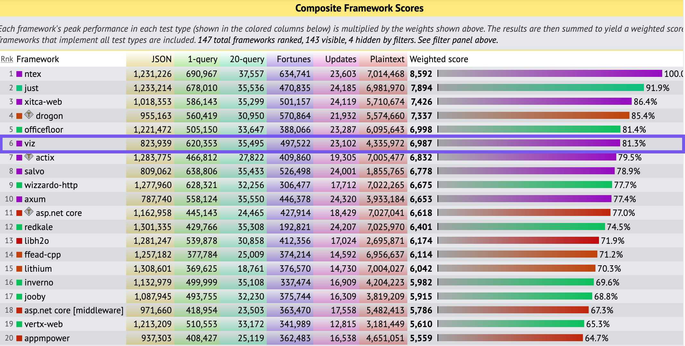
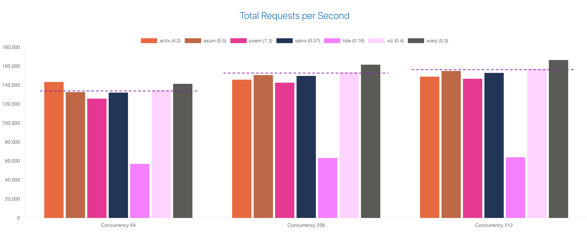

# Benchmarks

## TechEmpower Framework Benchmarks (TFB)

- [Repository](https://github.com/TechEmpower/FrameworkBenchmarks)

- [Result](https://www.techempower.com/benchmarks/#test=composite)

RunID [7ce481b2-49ec-4a4d-952d-bb1334](https://www.techempower.com/benchmarks/#section=test&runid=7ce481b2-49ec-4a4d-952d-bb1334d4a4ad&test=composite)'s results is here:

## Web Frameworks Benchmark

- [Repository](https://github.com/the-benchmarker/website)

- [Result](https://web-frameworks-benchmark.netlify.app/compare?f=actix,axum,poem,salvo,tide,viz,warp)

