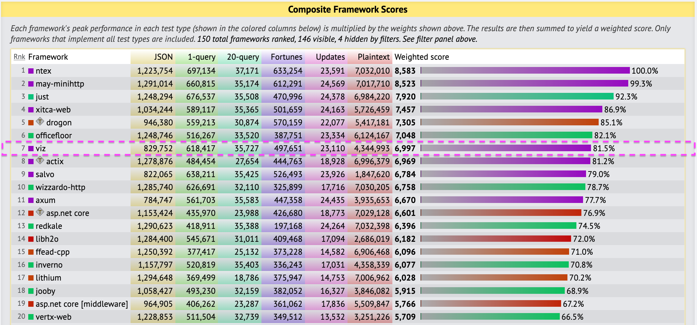

# Benchmarks

## Performance Optimization

In a real production environment, several approaches can be tried to optimize the application:

1. Specify **memory allocators**

	- [`mimalloc`](https://crates.io/crates/mimalloc)

	- [`snmalloc-rs`](https://crates.io/crates/snmalloc-rs)

	- [`jemallocator`](https://crates.io/crates/tikv-jemallocator)

2. Declaring **static variables**

	- [`once_cell`](https://crates.io/crates/once_cell)

	- [`lazy_static`](https://crates.io/crates/lazy_static)

3. Putting a small portion of data on the **stack**

	- [`smallvec`](https://crates.io/crates/smallvec)

	- [`tinyvec`](https://crates.io/crates/tinyvec)

4. Using a `capacity` to new **vector** or **hash**, a least capacity elements without reallocating

5. SIMD

> In the TFB and WFB test environments, Viz did not use 1 and 3.

## TechEmpower Framework Benchmarks (TFB)

- [Repository](https://github.com/TechEmpower/FrameworkBenchmarks)

- [Result](https://www.techempower.com/benchmarks/#test=composite)

Here are the results for [dc15ab19-0139-4489-b767-36eab8443eb1](https://www.techempower.com/benchmarks/#section=test&runid=dc15ab19-0139-4489-b767-36eab8443eb1&test=composite):

## Web Frameworks Benchmark (WFB)

- [Repository](https://github.com/the-benchmarker/website)

- [Result](https://web-frameworks-benchmark.netlify.app/compare?f=actix,axum,poem,salvo,tide,viz,warp)

